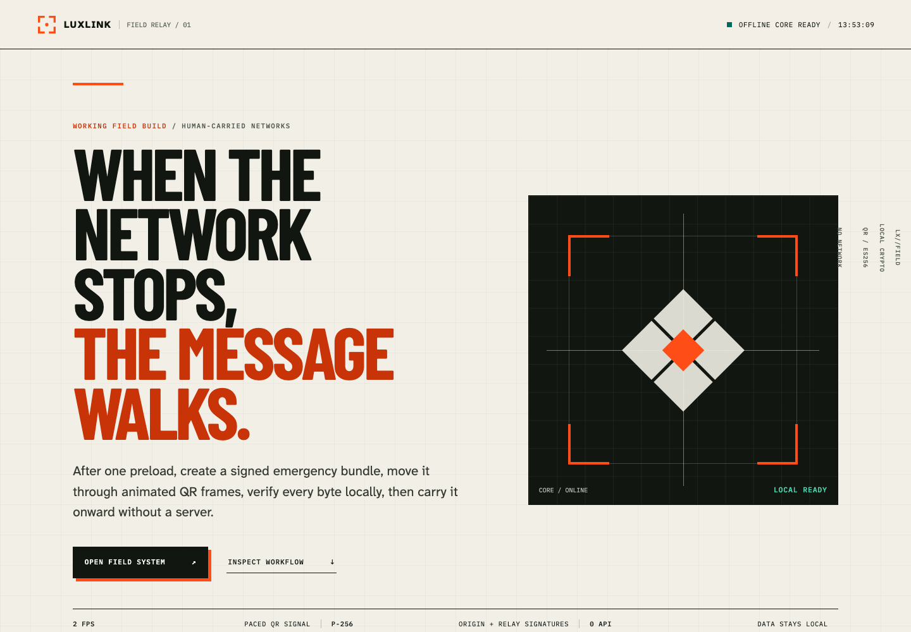
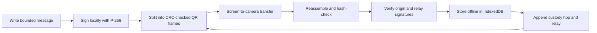
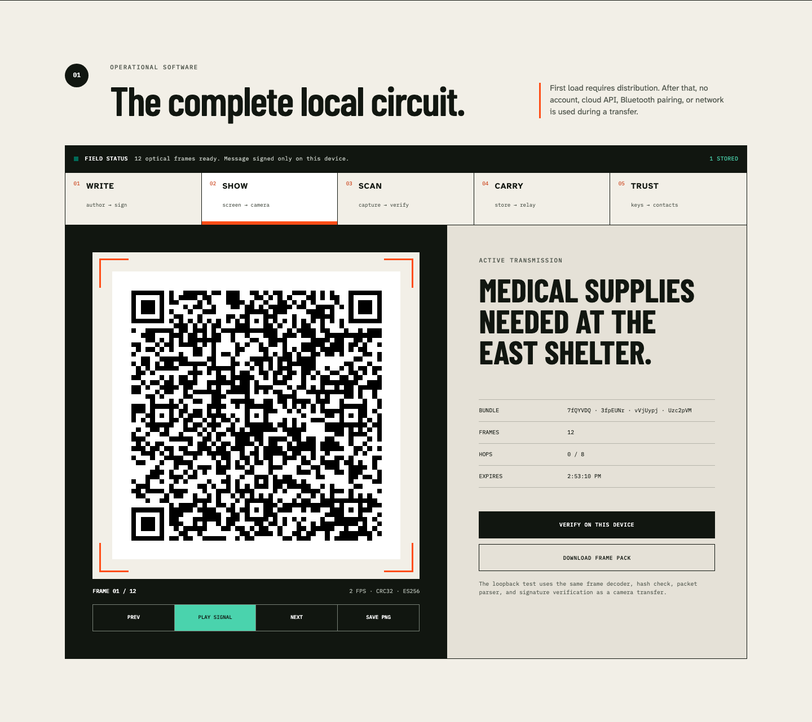
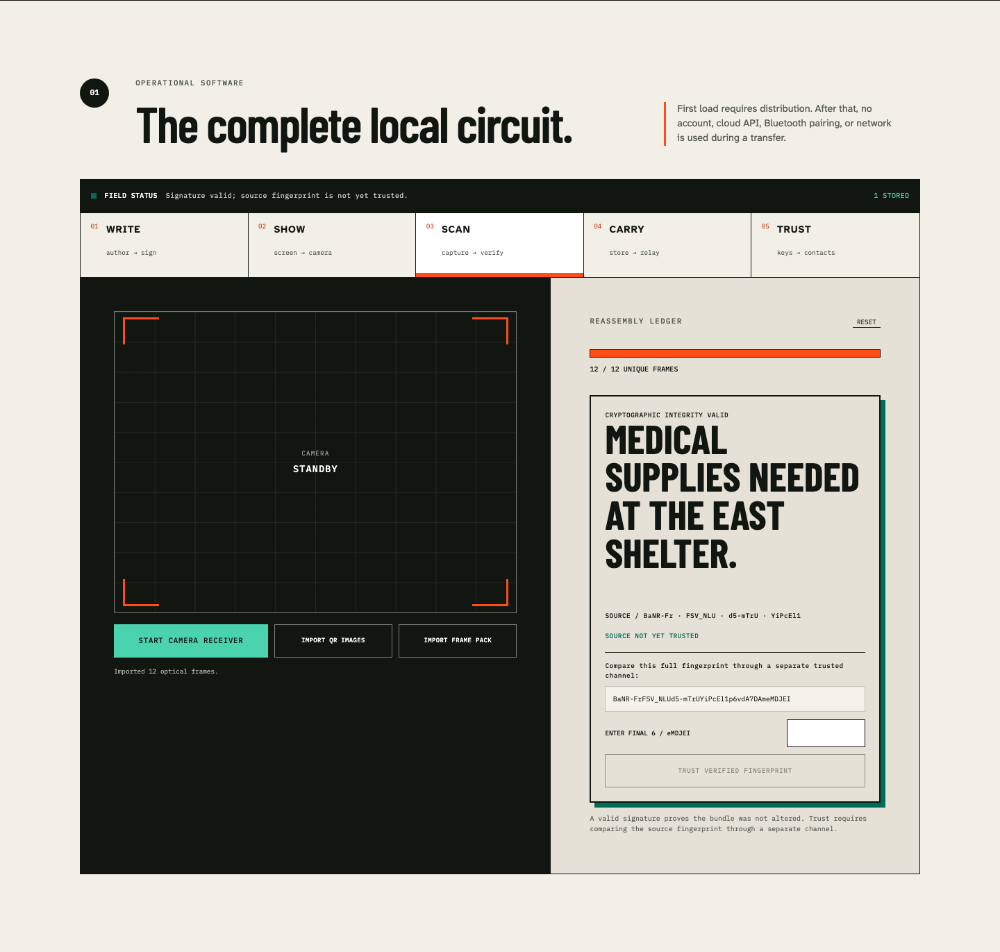

# LuxLink

[](https://github.com/Shreyp087/LuxLink/actions/workflows/ci.yml)
[](https://github.com/Shreyp087/LuxLink/actions/workflows/security.yml)

> **When the network stops, the message walks.**

LuxLink turns a browser into an offline, human-carried emergency relay: sign a small message, send
it as QR frames, verify it locally, store it, and relay it onward—without a server.



Built for **VoltHacks 2026**. The complete experience works with one computer and no special
hardware; two camera-equipped devices can demonstrate the real screen-to-camera path.

## The problem

During a network outage, two connected areas can become isolated islands. The information may
still exist and people may still move between those islands, but ordinary messaging assumes a
continuous path through cellular service, Wi-Fi, Bluetooth pairing, or a cloud backend.

LuxLink asks a different question: **what if the person walking across the gap becomes the network?**

## What LuxLink does

1. A sender writes a bounded emergency message in the browser.
2. LuxLink generates or reuses a local P-256 signing identity and signs the message.
3. The signed packet becomes a paced sequence of monochrome QR frames.
4. Another browser receives those frames through its camera, uploaded images, or a `.luxlink`
   frame pack.
5. The receiver reassembles the exact bytes, checks the transfer hash, verifies every signature,
   and stores the message locally.
6. A carrier can append a signed custody hop and transmit the packet again without changing the
   original message or signature.



## Why it is different

- **Store–carry–forward for people.** LuxLink models physical custody instead of pretending a
  live connection exists across an outage.
- **More than a QR code.** Messages are chunked into order-independent frames with CRC32 checks,
  a SHA-256 transfer digest, strict size limits, and duplicate-safe reassembly.
- **Integrity travels with the packet.** The self-contained packet includes the public keys needed
  to verify the origin signature and every append-only relay hop.
- **Trust stays honest.** A valid signature proves the bytes survived; it does not prove the signer
  is an emergency authority. LuxLink displays cryptographic integrity and human-approved source
  trust as separate states.
- **No backend dependency.** Signing, encoding, verification, storage, and relaying happen locally.
  The installable PWA reopens after its first load without a network.
- **No-hardware proof path.** “Verify on this device” traverses the same framing, reassembly, hash,
  parser, and signature-verification pipeline as camera reception.

## Product tour

### Send a real optical packet



### Verify integrity and make trust explicit



## Try the complete flow in two minutes

Requirements: Node.js 24+, Corepack, and a current Chromium, Firefox, or WebKit browser.

```bash
corepack enable
pnpm install --frozen-lockfile
pnpm dev
```

Open the printed local URL, then:

1. Keep the prefilled incident or enter your own 160-byte message.
2. Select **SIGN & PREPARE SIGNAL**.
3. Inspect the generated QR sequence, frame count, bundle fingerprint, and expiry.
4. Select **VERIFY ON THIS DEVICE** for the complete no-hardware loopback.
5. Open **SCAN** to see the verified receipt, then **CARRY** to see the offline inbox.
6. Select **SIGN + RELAY** on the stored record to append a signed custody hop.

For a two-device demonstration, preload LuxLink on both browsers, display the QR sequence on the
sender, and choose **START CAMERA** on the receiver. Camera access requires HTTPS or localhost and
explicit browser permission.

## Technology and components

| Layer             | Technology                                                             |
| ----------------- | ---------------------------------------------------------------------- |
| Interface         | React 19, TypeScript, Vite 8, hand-authored responsive CSS             |
| Offline runtime   | Installable PWA, service worker precache, IndexedDB                    |
| Cryptography      | Web Crypto API, ECDSA P-256/SHA-256, SHA-256 content addressing        |
| Optical transport | `qrcode`, ZXing browser/core, 2 FPS QR profile, CRC32 frames           |
| Protocol          | Strict canonical JSON, bounded packets, signed append-only relay chain |
| Tooling           | pnpm workspaces, Turborepo, ESLint, Prettier, Vitest, Node test runner |
| Browser QA        | Playwright on Chromium, Firefox, and WebKit                            |
| Supply-chain QA   | GitHub Actions, CodeQL, dependency review, lockfile audit              |

No cloud API, account system, database server, radio accessory, or custom electronics are required.

## Repository map

```text
apps/web              Offline PWA, optical sender/receiver, local inbox, trust UI
packages/protocol     Canonical data model, signing, verification, framing, relay rules
docs/assets           Submission-ready product screenshots
docs/design           Visual research and the Signal Ledger interface system
docs/engineering      Architecture, decisions, workflow, testing, and operations
docs/product          Product contract and implemented MVP acceptance record
docs/protocol         LuxLink v1 packet and optical wire specification
docs/security         Threat model, trust boundary, and explicit non-claims
docs/submission       Ready-to-paste Devpost copy, demo script, and final checklist
scripts               Reproducible submission screenshot capture
```

Start with the [architecture](./docs/engineering/architecture.md),
[protocol specification](./docs/protocol/spec-v1.md), and
[threat model](./docs/security/threat-model.md) for the technical design.

## Verification evidence

The submission state is exercised by one command:

```bash
pnpm validate
```

It runs formatting, lint, type checking, unit tests, a production build, and Playwright end-to-end
tests across Chromium, Firefox, and WebKit. The automated suite covers:

- canonical serialization, signing, tamper rejection, strict parsing, framing, and relay limits;
- create → QR/frame pack → receive → verify → persist → reload;
- rendered QR images decoded back into a verified bundle;
- offline service-worker startup;
- unknown-source confirmation, trust removal, and current-trust rendering;
- mobile and desktop browser behavior.

The current evidence record is in [software-mvp.md](./docs/product/software-mvp.md); live results are
available in [GitHub Actions](https://github.com/Shreyp087/LuxLink/actions).

## VoltHacks submission kit

- [Ready-to-paste Devpost submission](./docs/submission/devpost.md)
- [90-second no-hardware demo script](./docs/submission/demo-script.md)
- [Final submission checklist](./docs/submission/checklist.md)
- [Product screenshots](./docs/assets)
- [Source repository](https://github.com/Shreyp087/LuxLink)

LuxLink fits the **Open Innovation / Anything Engineering Based with Impact** challenge: it is a
software-only communications prototype with a clear path to optional camera-to-camera field use.

## Safety and scope

LuxLink is an experimental hackathon prototype, not a replacement for 911, emergency alerts,
cellular networks, AirDrop, or Quick Share. Visible optical transmissions are public by default;
signatures provide integrity and issuer provenance, not confidentiality. The prototype has not
been certified, independently audited, or physically field-qualified on phone pairs, and it is not
endorsed by FEMA, the FCC, or emergency services.

## Author

Built by [Shrey Patel](https://github.com/Shreyp087) for VoltHacks 2026.
